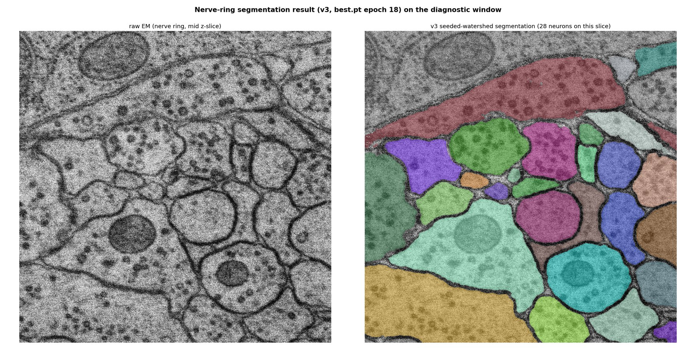
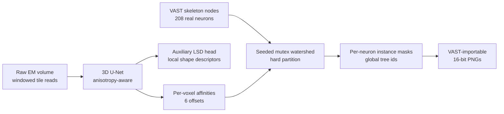
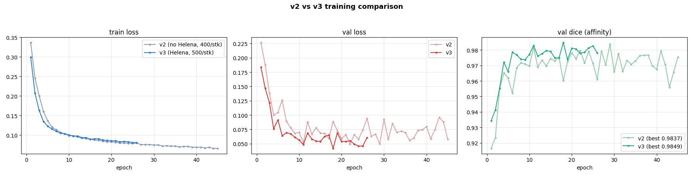

# Whole-Worm Neuron Segmentation from Serial-Section EM

**Dense, per-neuron instance segmentation of a *Pristionchus pacificus* nervous system from
serial-section electron microscopy — a 3D U-Net predicting voxel affinities, resolved into
individual neurons by seeded mutex watershed using complete manual VAST skeletons as markers.**




> **Left:** raw EM of the nerve ring (the densest, connectome-critical region). **Right:** the
> v3 model's output — 28 tightly packed neurons on a single section, each assigned a distinct
> identity with **zero structural overlap** between neurons.

---

## Overview

Reconstructing a connectome means tracing *every* neuron through a stack of electron-microscopy
sections and knowing, at each voxel, which neuron it belongs to. Doing this by hand is a
months-long effort per animal. This project automates the per-neuron labeling step for a
*Pristionchus pacificus* (nematode) volume, using the researcher's own manually traced skeletons
as anchors so that every predicted mask maps to a known, biologically real neuron.

The full target volume is **102,400 × 36,864 × 1,060 voxels** (2 × 2 × 30 nm) — far too large to
hold in memory — seeded by **208 complete neuron skeletons** (213,283 traced nodes) exported from
[VAST](https://lichtman.rc.fas.harvard.edu/vast/).

## Why affinities + seeded watershed

A first approach predicted each neuron's mask independently from a seed point. It worked, but had
a measured, fundamental flaw: neighboring neurons' masks could physically **overlap** (2–9% on
real data) because nothing tied the independent predictions together.

The current pipeline removes that failure mode by construction:



The network never sees *which* neuron it is looking at — it only predicts, for every voxel and a
set of neighbor offsets, whether the pair belongs to the same object (an **affinity**). Neuron
identity is injected only at the final step: **seeded mutex watershed** grows one hard partition
from the real skeleton nodes as markers. Because it produces a single partition, two different
neurons *cannot* share a voxel — overlap is structurally impossible, not merely unlikely.

An auxiliary **Local Shape Descriptor** head ([Sheridan et al., 2023](https://doi.org/10.1038/s41592-022-01711-z))
is trained alongside the affinities, forcing the network to reason from broader context (e.g. to
carry a neuron across a section obscured by imaging dust) rather than local evidence alone.

## Results

- **Validation Dice 0.985** (v3 model) on held-out data.
- **Nerve ring:** ~28 neurons cleanly separated per section with **0 cross-neuron overlap** — the
  densest and most connectome-critical region.
- Runs end-to-end on the full tiled stack via overlapping-tile inference with global-id
  compositing, producing segmentation directly importable back into VAST.



> Iterative model development (v2 → v3): adding a sixth annotated stack and stronger augmentation
> gave consistently lower validation loss and the best val Dice (0.9849).

## Engineering highlights

Beyond the model, a large part of the work was making messy, undocumented, multi-hundred-GB
microscopy data usable:

- **Reverse-engineered two proprietary data formats** from scratch — webKnossos WKW volume
  annotations and VAST's tiled multi-resolution pyramid — verifying each decode against the tools'
  own recorded anchor points (byte-exact tile stitching, content-hashed decode cache).
- **Windowed, out-of-core reader** for a volume 100× too large for RAM: only the tiles
  intersecting a requested region are ever touched.
- **Two full model architectures** implemented, trained, and compared (seeded per-instance vs.
  affinity+LSD), with the switch driven by a *measured* limitation, not a hunch.
- **Physically-grounded, anisotropy-aware design** throughout: 2 × 2 × 30 nm voxels mean pooling,
  affinity offsets, and augmentation all treat the z axis (15× coarser) differently from in-plane.
- **Domain-specific augmentation** simulating real serial-section defects (missing/degraded
  sections, section-to-section misalignment).
- **Production-minded pipeline**: resumable training with live ETA and CSV logging, tiled
  inference with a trusted-core halo to avoid boundary artifacts, and a hard-won lesson on Windows
  multiprocessing + CUDA that shaped the final in-process design.

## Repository layout

```
src/seeded_unet/
  affinity_model.py      anisotropy-aware 3D U-Net (affinity + LSD heads) — current model
  affinity_targets.py    dense affinity + multi-instance LSD targets
  affinity_dataset.py    dense random-crop patches with augmentation
  affinity_train.py      training CLI (checkpointing, resume, CSV logs)
  affinity_infer.py      GPU forward pass -> per-voxel affinity probabilities
  watershed.py           seeded mutex watershed (mwatershed) -> instance labels
  full_stack_export.py   tiled whole-region inference + VAST-importable PNG export
  slice_regions.py       scopes inference to where neurons actually are (node clumps)
  augmentations.py       serial-section artifact / misalignment / flip / rotation
  phase_b_stack.py       windowed out-of-core reader for the full tiled EM stack
  vast_skeleton.py       parses + subsamples the real VAST skeletons (seeds)

  model.py / dataset.py / seeds.py / lsd.py / infer.py   earlier seeded per-instance model
scripts/                 thin CLI entry points
```

Full design rationale, data findings, and open questions live in [PLAN.md](PLAN.md); the current
state-of-the-project and pipeline details are in [HANDOFF.md](HANDOFF.md).

## Getting started

```bash
py -m pip install -r requirements.txt        # Python 3.11; CUDA auto-detected
py scripts/inspect_data.py                    # decode + sanity-check the training stacks
py scripts/affinity_train.py --epochs 30      # train the affinity+LSD model
```

Training discovers every `Training Data/<Stack>/` folder automatically (raw EM slices + one
webKnossos annotation zip); new stacks just need to be dropped in. Per-epoch metrics stream to
`outputs_affinity/training_log.csv` and checkpoints to `outputs_affinity/checkpoints/`.

Inference on the full worm additionally needs the external EM drive and `Data/VAST_skeleton_data.csv`
(too large/sensitive to check in); see [HANDOFF.md](HANDOFF.md) for the full Phase B workflow and
VAST re-import settings.

## Known limitations & roadmap

- **Membrane bleed in sparse regions.** Where a neuron has no traced neighbor competing in a patch
  *and* local membranes are faint, the lone seed can flood across under-detected boundaries. This
  is an affinity-quality (model-level) issue, confirmed *not* fixable by watershed tuning or
  post-processing. The next planned lever is a **boundary-weighted affinity loss** that up-weights
  thin membrane voxels.
- **Scaling the export** across the full z-extent of the nerve ring is in progress.

## References & tools

- Arlo Sheridan et al., *Local shape descriptors for neuron segmentation*, Nature Methods (2023).
- Mutex watershed via [`mwatershed`](https://github.com/pattonw/mwatershed).
- [VAST](https://lichtman.rc.fas.harvard.edu/vast/) (Volume Annotation and Segmentation Tool) and
  [webKnossos](https://webknossos.org/) for the manual annotations.

*EM data and skeleton annotations are the property of the originating lab and are not distributed
in this repository.*
